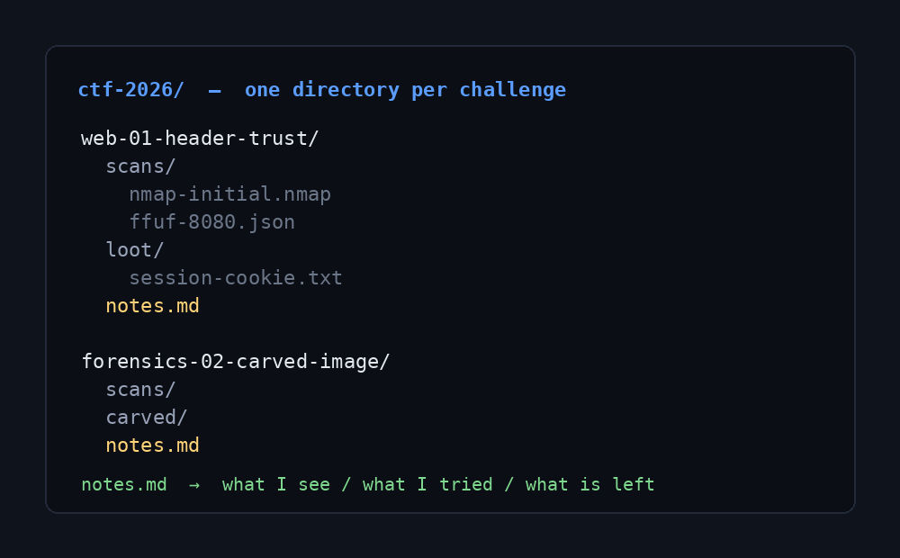

This file exists to show how drafts behave.

Because its frontmatter contains `draft: true`, it appears while you run
`npm run dev` so you can preview it, and it is left out of `npm run build` —
so it never reaches GitHub Pages.

Remove the `draft: true` line (or set it to `false`) when the post is ready,
then commit and push.

## Adding an image

Drop the file in `src/assets/images/`, then reference it relative to this post:

That is the whole workflow — no config, no import, no manifest.
