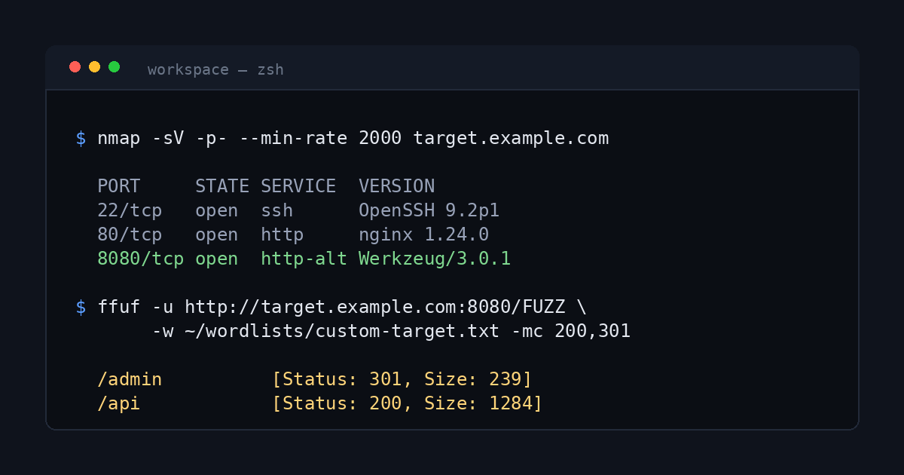

This post is a **draft**: it shows in `npm run dev` and never on the live
site. Open the file (`src/content/posts/style-reference.md`) side by side
with the rendered page and copy whatever you need.

The image above is the **header image**. It comes from `image:` and
`imageAlt:` in the frontmatter, not from the body, and it's also the share
preview for this post. Best size is 1440 × 756.

## Headings

The post title is the only `#` heading. Sections start at `##`.

### A third-level heading

Use `###` to split a section into parts.

#### A fourth-level heading

`####` is the smallest worth using. Deeper than this usually means the post
needs restructuring, not another heading level.

## Text

A normal paragraph. Leave a blank line between paragraphs, because a single
line break inside a paragraph is ignored, so you can wrap lines in your editor
wherever you like.

**Bold** for the one phrase that matters. *Italic* for emphasis or a term
being introduced. ***Both*** very rarely. ~~Strikethrough~~ for something
that turned out wrong. `inline code` for commands, flags, paths and values:
run `nmap` with `--min-rate 2000`, look in `/etc/passwd`, set `admin=true`.

Links: [an external site](https://owasp.org/www-project-top-ten/), [another
post](/blog/posts/getting-started-with-bug-bounty), [a section of a
post](/blog/posts/getting-started-with-bug-bounty#recon-that-you-can-repeat-tomorrow),
[a tag page](/blog/tags/ctf) and [the About page](/blog/about). Internal links
always start with `/blog/`.

A bare URL becomes a link on its own: https://portswigger.net/web-security

Typography is handled for you: "straight quotes" become curly ones, and an
em dash can be typed directly — like this.

## Lists

Bullets:

- Subdomain enumeration
- Port scanning
  - Full TCP range first
  - Top 100 UDP after
- Content discovery

Numbered steps:

1. Read the scope page twice.
2. Copy it into `scope.md`.
3. Only then start recon.
   A step can run onto a second line if you indent it to line up.

A checklist:

- [x] Initial scan
- [x] Web enumeration
- [ ] Privilege escalation
- [ ] Write-up

## Quotes

> A normal quote, for citing someone else or quoting a message.
> It can run across several lines.
>
> — Someone worth quoting

## Callouts

> [!NOTE]
> Context the reader should keep in mind. The default callout.

> [!TIP]
> A shortcut or a better way to do something.

> [!IMPORTANT]
> Something the reader must not skip.

> [!WARNING]
> Only test hosts you're authorised to test.

> [!CAUTION]
> This will break things or can't be undone.

> [!TIP] Custom titles work too
> Put the title after the marker, on the same line. Callouts can hold
> **formatting**, `code`, [links](/blog/about) and lists:
>
> - first point
> - second point

## Code

### Terminal: commands only

Shell blocks (`bash`, `sh`, `zsh`, `shell`, `console`) get a `$` prompt on
each command. Continuation lines after `\` and `#` comments don't. Try
**Copy**: you get the commands without prompts.

```bash
# Full port scan, then service detection on what's open
nmap -p- --min-rate 2000 -oA scans/all target.htb
nmap -sC -sV -p 22,80,8080 -oA scans/services target.htb

ffuf -u http://target.htb/FUZZ \
     -w ~/wordlists/raft-medium-directories.txt \
     -mc 200,301,403
```

### Terminal: commands with output

Start command lines with `$ `. Everything else is output, shown dimmed, and
**Copy** takes only the commands:

```bash
$ id
uid=33(www-data) gid=33(www-data) groups=33(www-data)
$ sudo -l
Matching Defaults entries for www-data on target:
    env_reset, secure_path=/usr/local/sbin\:/usr/local/bin\:/usr/sbin\:/usr/bin

User www-data may run the following commands on target:
    (root) NOPASSWD: /usr/bin/find
$ sudo find . -exec /bin/sh \; -quit
# id
uid=0(root) gid=0(root) groups=0(root)
```

### Other languages

Python:

```python
import requests

s = requests.Session()
for order_id in range(10480, 10490):
    r = s.get(f"https://app.example.com/api/v2/orders/{order_id}", timeout=5)
    print(order_id, r.status_code, len(r.content))
```

An HTTP request:

```http
POST /api/login HTTP/1.1
Host: app.example.com
Content-Type: application/json

{"username": "admin", "password": {"$ne": null}}
```

JSON:

```json
{
  "id": 10482,
  "owner": "account-a",
  "total": 49.99,
  "internal_note": "should not be in this response"
}
```

JavaScript:

```javascript
fetch("/api/me", { credentials: "include" })
  .then((r) => r.json())
  .then((me) => console.log(me.role));
```

SQL:

```sql
SELECT username, password FROM users WHERE id = '1' OR '1'='1' -- ';
```

PowerShell:

```powershell
Get-ChildItem -Path C:\Users -Recurse -Include *.kdbx -ErrorAction SilentlyContinue
```

Plain text with no highlighting and no terminal styling (use `text`):

```text
programs/
└── example-corp/
    ├── scope.md
    ├── recon/
    └── findings/
```

## Tables

| Port | State | Service | Version       |
|-----:|-------|---------|---------------|
|   22 | open  | ssh     | OpenSSH 8.2p1 |
|   80 | open  | http    | nginx 1.18.0  |
| 8080 | open  | http    | Werkzeug 2.0  |

The `-----:` under a header right-aligns that column (good for numbers);
`:----:` centres it.

## Images

A screenshot in the body. This one is 1000 px wide, shown at 720, so it's
**click-to-zoom**. Click it, or tab to it and press Enter:


The same header image can be reused in the body too. It's 1200 × 630, so
it also zooms:



A small image from `public/` shows at its real size and doesn't zoom,
because there's nothing bigger to see:


Images go in `src/assets/images/<post-name>/` and are linked relative to
the post: `../../assets/images/<post-name>/file.png`. Screenshots should be
1440–2000 px wide.

## Downloads

Files for readers to download go in `public/files/<post-name>/` and are linked
with `/blog/` in front. Mention the size for anything large:

[Download the site icon (512 × 512 PNG, 152 KB)](/blog/icon-512.png)

## Footnotes

Footnotes keep side details out of the main text.[^1] They're numbered in the
order they're used, even when they have names,[^scope] and each one links back
to where it was cited.[^long]

[^1]: A short footnote.
[^scope]: This one is written as `[^scope]` in the Markdown, but still shows as a number.
[^long]: Footnotes can hold **formatting**, `code` and [links](/blog/about). They
    can run onto a second line when it's indented.

## Dividers

A horizontal line, for a hard break between parts of a post:

---

Use it sparingly. A `##` heading is usually the better way to split a post.
