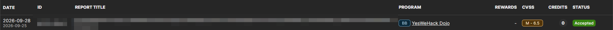

This is the [YesWeHack Dojo challenge of the month #54](https://dojo-yeswehack.com/challenge-of-the-month/dojo-54),
"Highscore." It's a small web challenge with a game-like front end: an
**INPUTS** tab where you type a string, a **SUBMIT** button, and a HUD that
reports the state of a `FILTER` as `ONLINE`, `BLOCKED` or `BYPASSED`. Somewhere
behind that filter is a flag, and the whole game is figuring out what to type in
one box to get it.

> [!NOTE] TL;DR
> Two bugs chain into reading another account's session. A "letters only" filter
> measures the input's length in characters but reads it as bytes, so a run of
> multi-byte padding (accented `é`) walks straight past it and drags a `"` into a
> JSON string that is built by hand. That quote lets me inject a second `session`
> key, and JSON's last-key-wins rewrites the database lookup into `WHERE id = 1`,
> the row whose `session` column holds the flag.

## Mapping what the box does

Before touching payloads I wanted the pipeline. Where does my string go, and
what touches it on the way? Reading the challenge code, the path is short:

```text
INPUT box  →  Url Encode node  →  parseCookie(input)  →  Users.findOne({ where: ... })
```

My string is URL-encoded, handed to a function called `parseCookie()`, and
whatever that function returns is used **as the lookup filter** for a database
query. That last part is the interesting bit. The result of parsing my input
doesn't get compared to anything, it *becomes* the `where` clause:

```javascript
const record = await Users.findOne({ where: cookie["session"] });
```

That distinction is the whole game. With an ORM, `findOne({ where: {...} })`
turns the object I hand it into a SQL query: `{ id: 1 }` becomes
`WHERE id = 1`, `{ session: "abc" }` becomes `WHERE session = 'abc'`. So if I can
control the *object*, I'm not just supplying a value to a fixed query, I'm
choosing which column it matches and what it matches against. That is a much
bigger primitive than "user-controlled value," and it's the same family of bug as
[NoSQL and ORM object injection](https://portswigger.net/web-security/nosql-injection),
where passing an object where the app expected a string lets you rewrite the
query itself.

So if I can control what `cookie["session"]` ends up being, I control which row
comes back. The rows that matter:

| lookup          | account   | what its `session` column holds                    |
|-----------------|-----------|----------------------------------------------------|
| `WHERE id = 1`  | `brumens` | the flag                                           |
| `WHERE id = 2`  | `bob`     | a flag-shaped value the challenge does not accept  |

Row 1 is the prize. The whole challenge collapses into a single question: can I
steer `parseCookie()` into returning an object that selects `brumens`, row 1?

## The one guard

Between my input and that query, there is exactly one check. `parseCookie()`
runs the string through a letter filter first:

```javascript
const bytes = Buffer.from(session, 'utf8');
for (let i = 0; i < session.length; i++) {
  const b = bytes[i];
  const isLetter = (b >= 0x41 && b <= 0x5a) || (b >= 0x61 && b <= 0x7a) || b >= 0x80;
  if (!isLetter) throw new Error('invalid game session');
}
```

Read literally, that loop says the session may only contain letters: `A-Z`,
`a-z`, or a high byte (`>= 0x80`). Anything else throws `invalid game session`.
Right after the filter, the parsed value is built by hand:

```javascript
return JSON.parse(`{"id":${id}, "session":{"session":"${session}"}}`);
```

Two things jumped out reading these together, and each one turned into a bug: the
loop, and this hand-built JSON string.

## Probe 1: is the comparison the way in?

First instinct: maybe the session I control is compared against the stored flag
somewhere, so I can just *type the flag's shape*. I tried a plain letters-only
string.

It builds fine, no error, but nothing happens. The value I supply is checked
against a value I don't know, and there is nothing typable that equals it. Dead
end, but a useful one: the way in is not matching the secret, it's controlling
the query. That refocused me on `cookie["session"]` flowing into `where`.

## Probe 2: can I break out of the JSON string?

If the parsed object is what matters, the hand-built JSON string is the lever. My
session is dropped between two double quotes with **no escaping**, so a `"` typed
in my input should close the string early and let me write JSON *structure*
instead of string *content*. I tried ASCII letters plus a quote, something like
`aaaa"...`.

Rejected: `invalid game session`. The letter filter sees the `"` (byte `0x22`),
which is below `0x41` and isn't a high byte, and throws. That confirmed two things
at once: the quote breakout is real and worth pursuing, but the filter stands in
the way, so I need to slip a `"` past a check that only allows letters and high
bytes.

## Probe 3: the filter's own bug

Back to the loop, and this time the mismatch is obvious once you're looking for
it. It **counts in characters** (`session.length` and `i`) but **indexes in
bytes** (`bytes[i]`).

Why those can differ needs one detour into UTF-8. Text is stored as bytes, and
UTF-8 uses a variable number of bytes per character: plain ASCII (`A-Z`, `a-z`,
digits, common punctuation) is one byte each, but accented and non-Latin
characters take two, three, or four. `é` is two bytes, `C3 A9`. Meanwhile
JavaScript's [`String.length`](https://developer.mozilla.org/en-US/docs/Web/JavaScript/Reference/Global_Objects/String/length)
counts UTF-16 code units (for `é`, one), while
[`Buffer.from(session, 'utf8')`](https://nodejs.org/api/buffer.html) gives the
actual bytes (for `é`, two). So the two counts only agree while the input is pure
ASCII.

Watch what that does to the loop when the input is `"aaé"`:

| index `i`                  | 0            | 1            | 2      | 3               |
|----------------------------|--------------|--------------|--------|-----------------|
| `bytes[i]`                 | `0x61` (`a`) | `0x61` (`a`) | `0xC3` | `0xA9`          |
| read by the loop (`i < 3`) | yes          | yes          | yes    | **no, skipped** |

The two bytes `0xC3 0xA9` together are the single character `é`, so
`session.length` is `3` but `bytes` has **four** entries. The loop's last read is
`bytes[2]`; `bytes[3]` sits one step past the finish line and is never checked.
Every extra multi-byte character pushes one more real byte off the end of the
loop's reach, so the tail of the input goes completely uninspected.

And here's what makes it exploitable rather than merely wrong. If I pad the front
of my input with a run of multi-byte characters, two things happen at once. Every
byte the loop *does* read from that padding is a lead or continuation byte, all
`>= 0x80`, which is exactly the branch the filter accepts, so the visible part
sails through. Meanwhile every padding character shortens the loop's reach relative
to the byte array, so my real payload ends up beyond the loop's stopping point and
is never checked at all. My `"` can hide in that blind region.

I tested it with a single multi-byte character as the whole input. It was
**rejected**, which is the confirmation I wanted, not a failure: one padding
character isn't enough to move the loop's stopping point past the payload, so the
read still lands on my real bytes and throws. The bypass depends on the gap being
*wide enough*, not on some other parsing quirk. I just needed more padding.

> [!NOTE]
> The character choice matters as much as the count, and this is where the
> `Url Encode` step in the pipeline comes in. It surprised me: a stock
> `encodeURIComponent('é')` returns `%C3%A9`, and that `%` (byte `0x25`) would fail
> the letter test and break the payload. In this challenge, though, the encode step
> passes `é` through as its literal `C3 A9` bytes, while a character in the `U+0400`
> to `U+07FF` range does come out percent-encoded. So `é` is the clean choice: two
> bytes, both `>= 0x80`, reaching the filter intact. I pinned down which characters
> survive by testing them rather than trusting my mental model of the encoder.

## Probe 4: building a valid injection

Now I have a way to smuggle a `"` past the filter. The remaining problem is that
`JSON.parse()` still has to *succeed*: the whole string must be well-formed JSON,
including the template's own trailing `"}}`. So the breakout has to open and close
every bracket it introduces and leave the tail balanced.

The object I want to end up with is `{"id":1}`, because that becomes
`WHERE id = 1` and selects `brumens`. The trick is JSON's **last-key-wins**
behaviour: when an object literal lists the same key twice, the last value is the
one that survives. `JSON.parse('{"a":1,"a":2}')` returns `{ a: 2 }`, not an error.
The template already opens a `session` key for me, so if I inject a *second*
`session` key later in the string, mine is the one that wins. Here's the shape I
aimed the parser at:

```json
{"id":0, "session":{"session":"<pad>"},"session":{"id":1},"pad":{"x":""}}
```

Walking the tokens my input supplies, after the padding:

- `"` closes the injected session string,
- `}` closes the inner `session` object the template opened,
- `,"session":{"id":1}` adds the duplicate `session` key, the one that wins,
- `,"pad":{"x":"` opens one last key so the template's own trailing `"}}` closes
  it cleanly instead of dangling.

Concretely, with the `id` set to `0` and the session filled in, the exact string
handed to `JSON.parse()` is (padding shortened here):

```json
{"id":0, "session":{"session":"ééé…é"},"session":{"id":1},"pad":{"x":""}}
```

That is valid JSON, and last-key-wins collapses the two `session` keys into the
second one, so it parses to:

```javascript
{ id: 0, session: { id: 1 }, pad: { x: "" } }
```

`cookie["session"]` is therefore `{ id: 1 }`, and that object flows straight into
`Users.findOne({ where: ... })` as `WHERE id = 1`. Row 1 is `brumens`, the flag
row.

One value I had to find by testing: the padding needs to be at least **34** `é`
characters before the loop's stopping point clears the payload. Fewer than that
and the read runs onto my real bytes and throws. I used 40 for margin.

## The payload

```text
0:éééééééééééééééééééééééééééééééééééééééé"},"session":{"id":1},"pad":{"x":"
```

That's a `0:` prefix, 40 `é`, then the JSON breakout. The `0:` prefix is there
because the function splits on the first colon and treats the left side as the
`id`; the `0` is a decoy, and the injected `{"id":1}` is what actually drives the
lookup.

Submitting it on my own account, the HUD's `FILTER` line flips from `ONLINE` to
**`BYPASSED`** rather than `BLOCKED`, the flag renders on the game screen, and the
solved popup fires. In the DOM, the shell element ends up with
`data-has-flag="true"` and `data-flag` holding the value. Swapping the injected
`id` to `2` returns `bob`'s row instead, which is how I confirmed the id genuinely
comes from my input and isn't baked into the code.

<div class="center">


</div>

> [!SPOILER] Flag
> ```text
> FLAG{N3w_L3v3l_Unl0cked}
> ```

## Why this matters beyond the game

It's tempting to file this under "input filter had a bug." It's worse than that.
The filter is the *only* control deciding whose account the query looks up, and I
never had to defeat the JSON parser to get past it: the padding alone carried the
`"` through. Any code shaped like this, a hand-built JSON string plus a length
check that mixes bytes and characters, behaves the same way. The constraint only
ever applies to the region the attacker fully controls, and whatever the parser
produces afterward reaches the query unvalidated. In a real application that's not
cosmetic. It's a decision about whose session the backend trusts, made by a loop
that can't count.

## Fixing it

Three changes, each closing one link in the chain.

**Don't hand-build JSON.** Serialise an object and let the runtime escape it:

```javascript
return { id, session: { session } };
```

**If the session genuinely must be letters, iterate characters, not bytes,** so
the index and the byte offset can't drift apart:

```javascript
for (const ch of session) {
  const b = ch.codePointAt(0);
  const isLetter = (b >= 0x41 && b <= 0x5a) || (b >= 0x61 && b <= 0x7a) || b >= 0x80;
  if (!isLetter) throw new Error('invalid game session');
}
```

**And never pass a parsed value straight into an ORM `where` clause.** Pull out
only the field you actually mean to filter on:

```javascript
Users.findOne({ where: { session: String(cookie.session) } });
```

Any one of these breaks the exploit. All three together make the whole class of
bug impossible.

## Disclosure

I wrote this up and reported it to the YesWeHack Dojo program, where it was triaged
and accepted at CVSS 6.5 (Medium).



## What I took away

- **Bugs love a unit mismatch.** A length check is only as trustworthy as the
  units it counts in. The instant bytes and characters can diverge, a "letters
  only" rule quietly stops meaning what it says, and everything downstream that
  trusts it inherits the hole.
- **Hand-built JSON is string-built SQL wearing a different coat.** The fix is the
  same lesson we learned for SQL long ago: serialise structured data, never
  concatenate it. When I catch myself typing a `{` inside a template string, that's
  the smell.
- **Failed probes are the map.** The single-`é` rejection and the bare-quote
  rejection each killed a theory and pointed at the next one. I got to the exploit
  faster by asking *why* each attempt failed, not just noting that it did.
